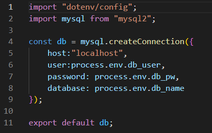
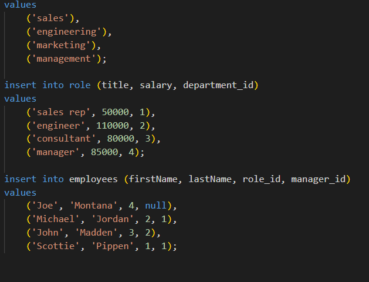
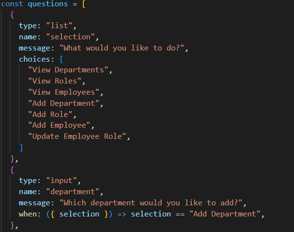
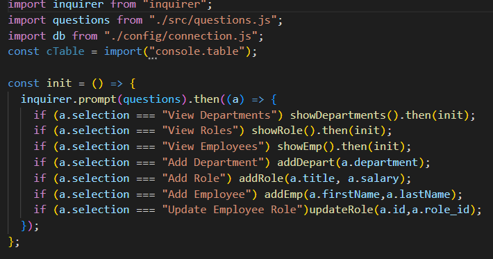
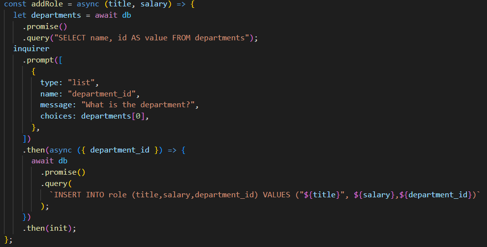
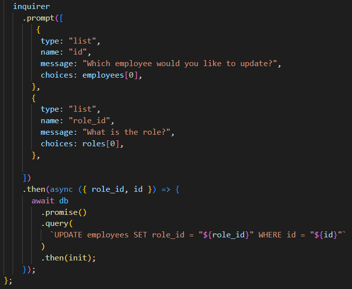

# Employee_Tracker

## Description
This is application to generate a list of profiles for a small work team. All the e-mail addresses and GitHub links are clickable. Each role for the company features different content for the employee profile card. You may view this at the [Deployed](https://github.com/DStefani86/TeamProfileGenerator).

## Table of Contents

[Installation](#installation)

[Usage](#usage)

[License](#license)

[Contributors](#contributions)

[Tests](#tests)

[Questions](#questions)

## Installation
Visit my GitHub repository featured in the Questions section below. Find the Employee Tracker repository. Clone the SSH down from my the repository into your own terminal and enjoy! Node must be installed to use this application and you must be within the file path that contains 'index.js'. After you have gone through the installation process, run the 'node index.js' command in your terminal. Make sure to run 'npm i' in your terminal before engaging this application. A series of prompts will appear.

## Usage

I am including some examples of my code to demonstrate the functionality of my application. I wanted to showcase the simplicity of my javascript files. First are my connections.

These are the seeds I built into my db tables 

An examples from my questions using Inquirer

These are my IF statements to navigate through the prompts

A function I created to highlight using SELECT and INSERT into my tables from Inquirer 

Finally, this is my function to incorporate using UPDATE syntax into my inquirer prompts

If you have any other curiosities about the functionality of this application please watch the tutorial video I have included

[Video Example](https://drive.google.com/file/d/1yLEEKDhiZWdxZTovqK9QxvnWTgc_EuWU/view)

## License 
This application is licensed by MIT

## Contributions
The Studious Studiers Discord!!

## Tests
.

## Questions
You can reach me at stefanibusiness@gmail.com or via GitHub [DStefani86](https://github.com/DStefani86)